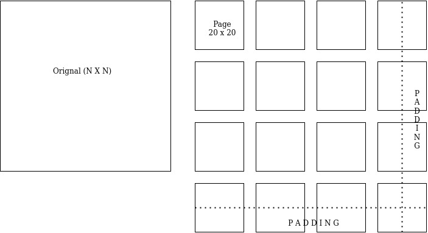

# Data Systems Phase 0

## Part 2 - Page Layout
- Every matrix on load will be divided into 20 x 20 chunks. And will be stored in temp as such.
- The breaking of matrix will be chunk wise and not row / column wise.
- For eg. a 40 x 40 matrix will contain 1600 elements and thus will be divided into 4 20 x 20 matrices each containing 400 elements.
- The divsion for the above matrix will be as follows:
- 1. First chunk will have the suffix _0_0 and will contain rows 0 to 19 and columns 0 to 19.
- 2. Second chunk will have suffix _0_1 and will contain rows 0 to 19 and columns 20 to 39.
- 3. Third chunk will have suffix _1_0 and will contain rows 20 to 39 and columns 0 to 19.
- 4. Fourth chunk will have suffix _1_1 and will contain rows 20 to 39 and columns 20 to 39.
- The pages which are not fully filled will be padded with zeroes.
  
## Part 2 - In Place Cross transpose implementation 
1. For cross transpose one block (according to cross transpose) from each of the matrices will be brought into the main memory. ( Row wise for A and columnwise for B )
 For eg. if we bring block with suffix _0_1 from matrix A into main memory the block with suffix _1_0 from matrix B will be brought.
2. We will iterate the block from matrix A in row wise and matrix B in column - wise order simultaneously.
3. We will swap the selected elements.
 So in the above mentioned blocks element 1,2 will be swapped with 2,1 of the other block.

## Part 3 - Page layout for sparse matrix
1. For storing the information we will use a triplet structure which will consist of row followed by column and then the value at that particular position.
2. We will avoid the zeroes while implementing the above way.
3. While loading we will open an empty block and start filling it wth the encountered value.

## Part 4 - Transpose technique for sparse matrix 
1. We will linearly traverse the orignal matrix.
2. We will keep two types of temporary blocks data and index.
3. When we encounter a data point in the orignal matrix we flip the row value and column value for that point.
4. We search the index blocks which contain the ending row and column value corresponding to every block.
For eg. we have the changed row value as 2 and changed column value as 3 and the index block have entries as 1,1,1 , 2,2,2 , 3,4,2 (row, column, block suffix). So we can see (using binary search) that the corresponding data block for us is 3,4 (as the values represent the value int the block.) so we now go to the 3rd data block (as the value is 3rd in index block). we apply binary search in block to find the postion for new item and add it there and shift other elements if we have to.
5. Whenever the data block reaches it max size we split it into two from the middle(as the block is always sorted). And update the index block accordingly. We also split the block suffix for eg 2_1 will be split in 2_1_0 and 2_1_1.
6. If the index block gets full we add an extra index block. When there are multiple index blocks we only need to check the last entry to see whether the detination block suffix will be in that index block or not.
7. After we are done we simply remove the orignal matrix blocks and the index blocks. We then move sequentialy( nuumeric orded) in the new data blocks and rename them appropriately.
8. We can exercise the option of using compaction in the above step if the average number of entries per block falls down below a load factor. 
